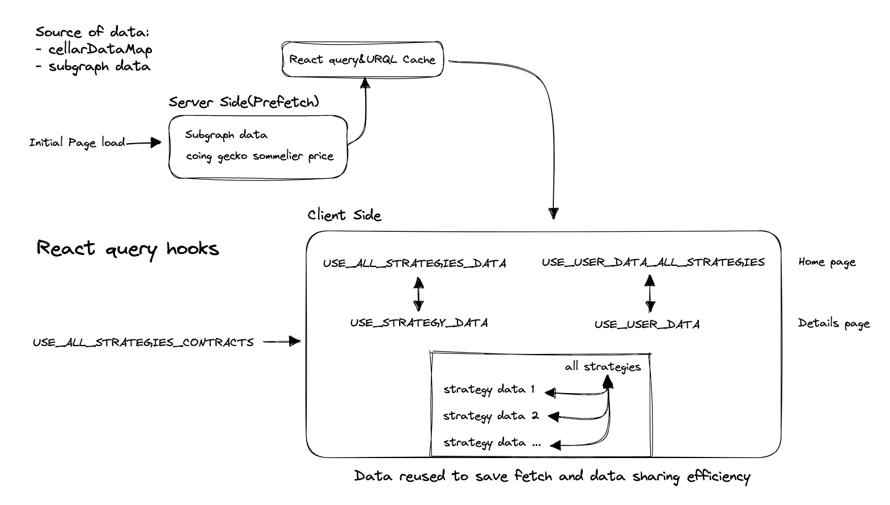

# somm-boilerplate

- [Getting Started](#getting-started)
- [Using contracts](#interacting-with-contracts)
- [Hardcoded values](#hardcoded-values)
- [Data Flow](#data-flow)
  - [Getting the data](#getting-the-data)
    - [Data flow](#data-flow-1)
- [Displaying/Branching UI output](#displayingbranching-ui-output)

## Getting Started

First, run the development server:

```sh
# using npm
npm run dev

# using yarn
yarn dev
```

Open [http://localhost:3000](http://localhost:3000) with your browser to see the result.

You can start editing the page by modifying `pages/index.tsx`. The page auto-updates as you edit the file.

[API routes](https://nextjs.org/docs/api-routes/introduction) can be accessed on [http://localhost:3000/api/hello](http://localhost:3000/api/hello). This endpoint can be edited in `pages/api/hello.ts`.

The `pages/api` directory is mapped to `/api/*`. Files in this directory are treated as [API routes](https://nextjs.org/docs/api-routes/introduction) instead of React pages.

## Interacting with contracts
Viem and wagmi libraries are used for interacting with contracts.

Instead of creating new contract objects, you can import the existing contract from the "useCreateContracts" hook and use it in the components.

- [Viem Documentation](https://viem.sh/docs/contract/getContract)
- [Wagmi Documentation](https://wagmi.sh/react/getting-started)

Calling methods syntax:
```
contract.(estimateGas|read|simulate|write).(functionName)(args, options)
```


Examples of reading and writing:
```ts
import { useCreateContracts } from "data/hooks/useCreateContracts"

const { cellarSigner } = useCreateContracts(cellarConfig)

const [isSupported, holdingPosition, depositFee] = await cellarSigner?.read.alternativeAssetData([
          assetAddress
        ]
  ) as [boolean, number, number]

const hash = cellarSigner?.write.deposit(
        [amtInWei, address],
        { gas: gasLimitEstimated, account: address }
  )
```

# IP Detection using Vercel's headers

In order to block access to the app from sanctioned and restricted countries we are using Vercel's `x-vercel-ip-country` and `x-vercel-ip-country-region` to detect IP addresses. This is setup via a Next.js API route which reads the file from disk and performs a lookup against the IP. See `src/pages/api/geo.ts`.

The endpoint is hardcoded to use a restricted region unless you set the env vars `IP_COUNTRY`, and `IP_COUTNRY_REGION` (eg. `IP_COUNTRY='CA'` `IP_COUNTRY_REGION='BC'`). This API endpoint is then used by our GeoProvider (see `src/context/geoContext.tsx`). You can import the `useGeo()` hook to get access to the user's country, region, and a boolean that determines if they are in a restricted region or not. It's currently beging used in the `<Layout />` component to display a "Service Unavailable" banner and to block a user from connecting their wallet to the app.

# Multiple Sources of Truth

Unfortunately, as of writing this (03.08.22), there are multiple sources of truth cobbled together to present data to the user in the UI.

## Hardcoded values

Files of note:

- [`config.ts`](./src/utils/config.ts)
- [`cellarDataMap.ts`](./src/data/cellarDataMap.ts)
- [`tokenConfig.ts`](./src/data/tokenConfig.ts)

I outline these because they are the hardcoded data used to present asset symbols, apy, supported chains, etc. `cellarDataMap.ts` in particular is extensible, but the most fragile. It depends on an up-to-date cellar address to display the data correctly at a given cellar route. We have it set up to pull in that string from the `config.ts` file, but this certainly needs to be refactored in the future as we continue to support more strategies.

## Data Flow

Files of note:

- [`config.ts`](./src/utils/config.ts)
- [`data/cellarDataMap.ts`](./src/data/cellarDataMap.ts)
- [`data/hooks/*`](./src/data/hooks/)
- [`data/actions/*`](./src/data/actions/)

### Getting the data

If there's a new cellar with a different cellar or cellar router or staker contract that has a different ABI and output value, we should create output actions for it inside `data/actions/{CONTRACT_NAME_VERSION}/{outputName}`.

#### Data flow



Data reused to save fetch and data sharing efficiency through react query fetch strategy

## Displaying/Branching UI output

In the case we don't show specific UI output per cellar, We can specify what will be displayed or not inside /src/data/uiConfig.ts. Each function needs to be passed ConfigProps.

example:
We show "Rewards" only on `aave v2` cellar

```tsx
// src/data/uiConfig.ts
export const isRewardsEnabled = (config: ConfigProps) => {
  return config.cellarNameKey === CellarNameKey.AAVE
}

// somewhere in ui component
isRewardsEnabled(cellarConfig) && <RewardsCard />
```

# Learn More

To learn more about Next.js, take a look at the following resources:

- [Next.js Documentation](https://nextjs.org/docs) - learn about Next.js features and API.
- [Learn Next.js](https://nextjs.org/learn) - an interactive Next.js tutorial.

You can check out [the Next.js GitHub repository](https://github.com/vercel/next.js/) - your feedback and contributions are welcome!
